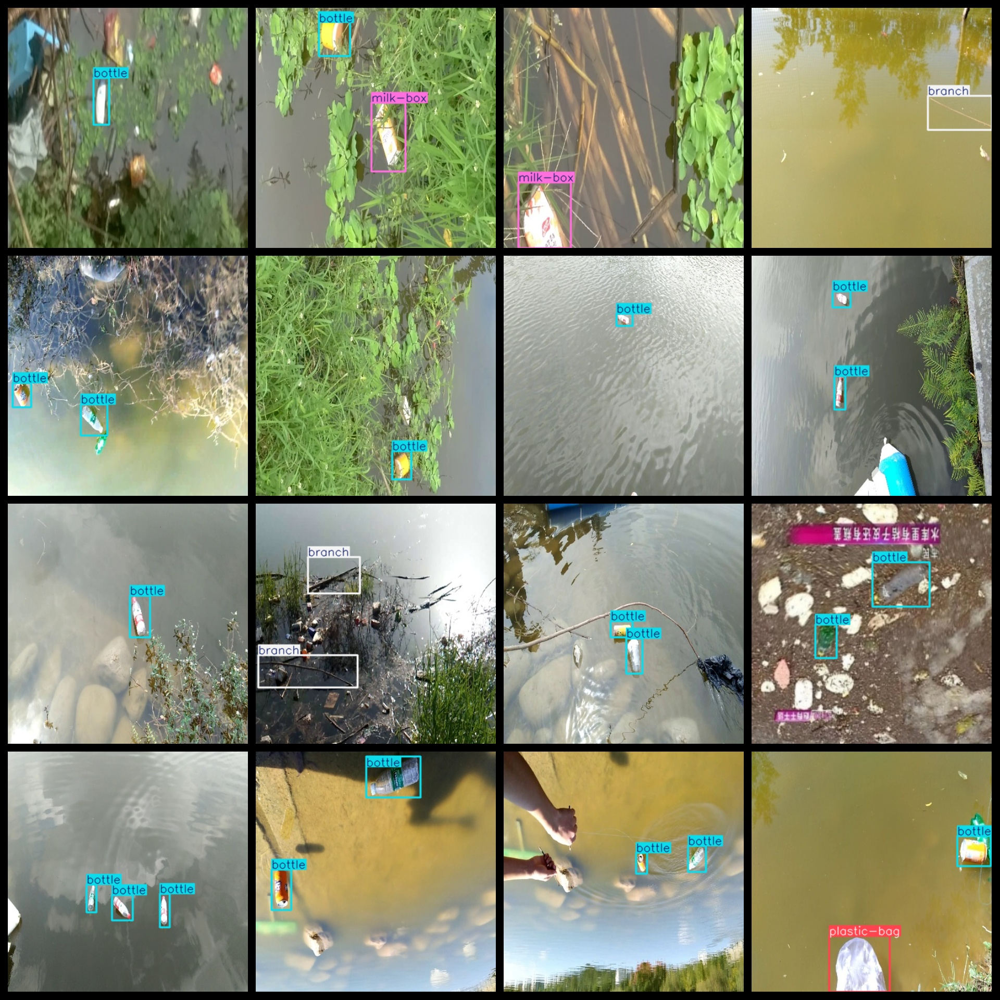
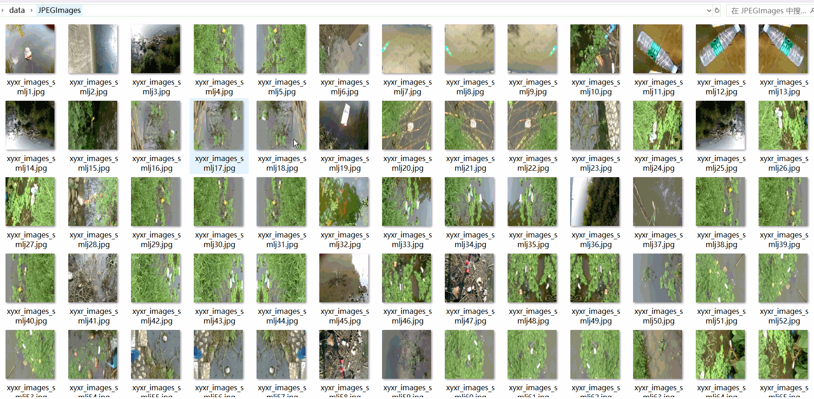

# Water Surface Floating Garbage 2400 images8-classVOC+YOLO format

water surface floating Garbage 2400stretch8kindVOC+YOLOformat

Dataset format: Pascal VOC format + YOLO format (the txt file does not contain the split path, it only contains jpg images and corresponding VOC format xml files and yolo format txt files)

Number of image files (jpg): 2400

Number of xml files: 2400

Number of txt files: 2400

Tagged Category Count: 8

The Github repository is: datasets_sl

["ball", "bottle", "branch", "grass", "leaf", "milk-box", "plastic-bag", "plastic-garbage"]

Tags: "ball", "bottle", "branch", "grass", "leaf", "milk box", "plastic bag", "plastic waste"

Number of boxes labeled in each category:

Ball Frames = 49

bottle frame count = 1691

Branch Frames = 434

Grass Frames = 201

Leaf Count = 267

The number of milk-boxes is 255.

Plastic-bag frame count = 411

Plastic-garbage frame count = 202

Total frames: 3510

Number of images per category:

Ball occupies 49 pictures.

Bottle has 1039 images.

The branch that holds 404 images.

Grass possesses 201 images.

Leaf occupies a total of 248 images.

The number of images owned by milk-box = 233

Plastic-bags-occupy-pictures-number = 393

Plastic-Garbage possesses 192 images.

Image resolution: 416x416

Use the labeling tool: labelImg

Dataset Augmentation: Yes

Rules for annotation: Draw a rectangle around the category.

Important note: The dataset does not have been divided into training, validation, and testing sets.

Special Disclaimer: This dataset does not guarantee the accuracy of the trained models or weight files.

Annotation and image details are as follows:

## Images

---

Here is a pay link on Stripe (https://buy.stripe.com/3cs8yP7sY87d0vu9AB). Please contact me lonlonago@foxmail.com after funding $89, and I will send you a complete data files, thank you!

